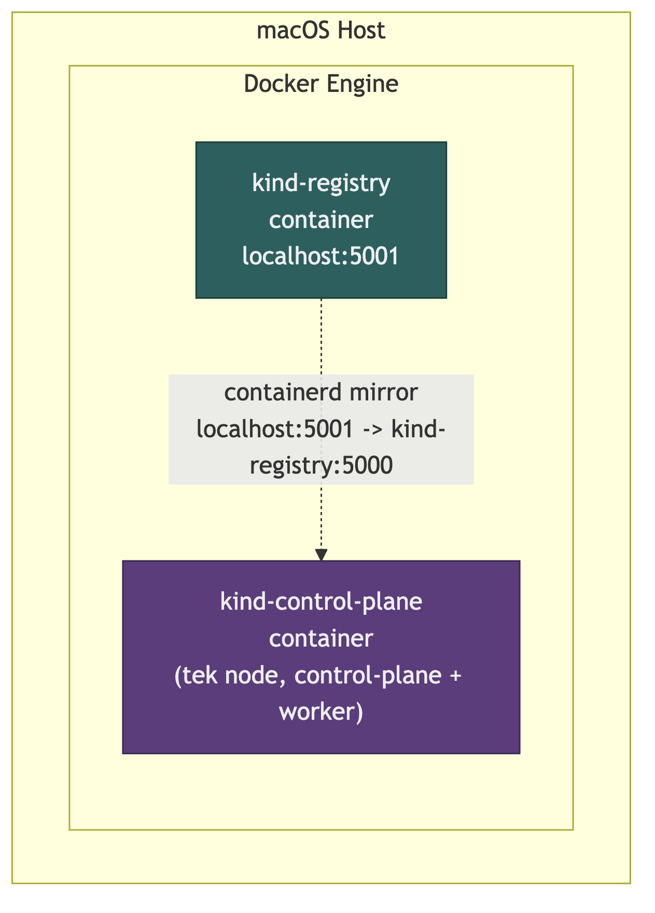
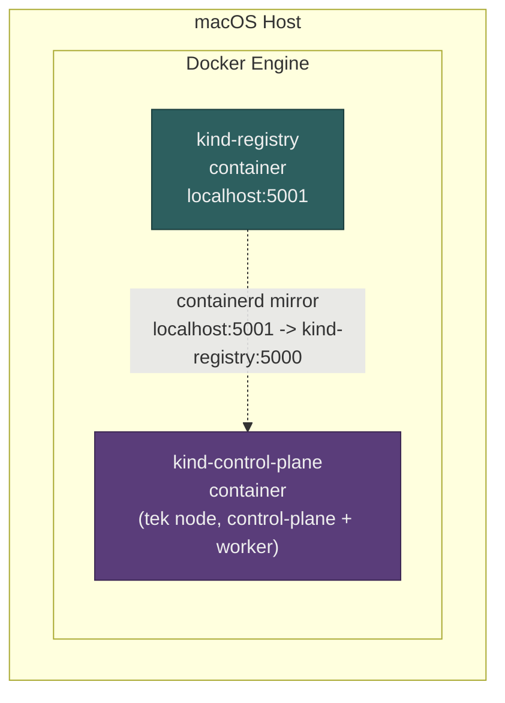
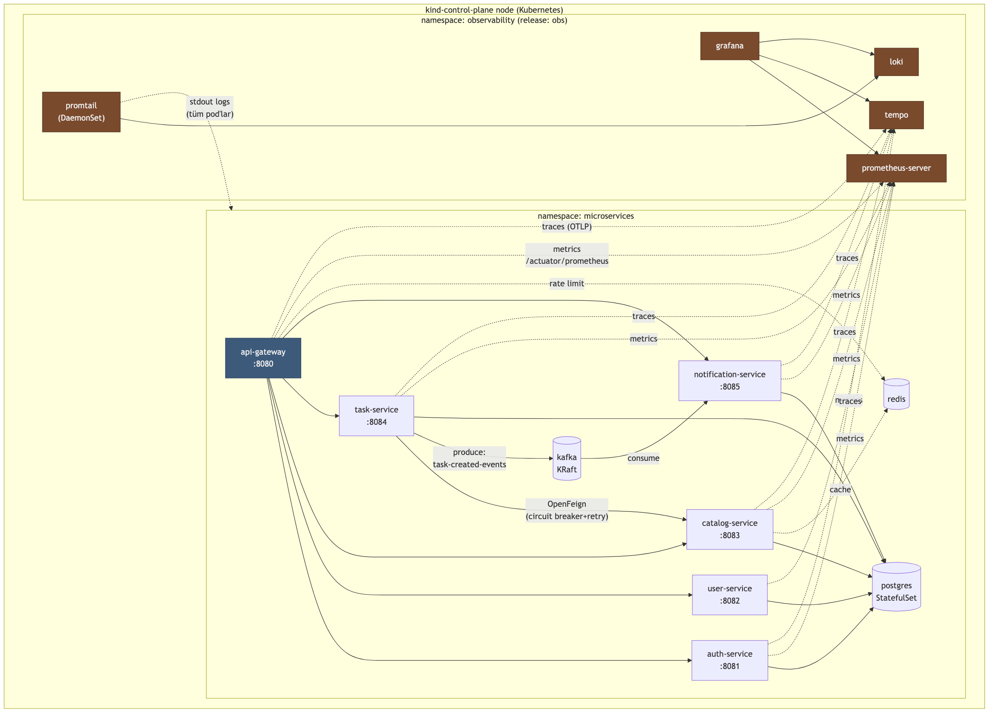
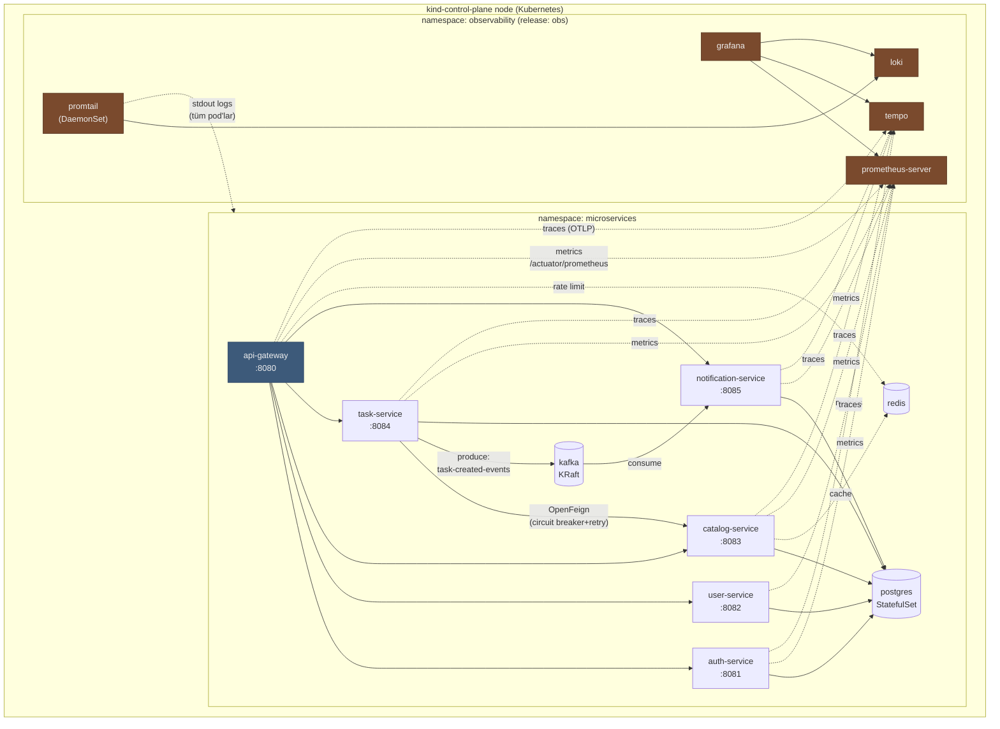

# Cluster Topolojisi

İki katman var: host makine üzerinde Docker'ın barındırdığı Kind node'ları, ve onun içinde çalışan gerçek Kubernetes cluster'ı.

## 1. Docker katmanı — Kind neyi neyin üzerine kuruyor

Mermaid kaynağı

Docker burada sadece **Kind'ın node'larını ve local registry'yi barındırıyor** — image build sürecinde (Jib) veya production'da yer almıyor.

## 2. Kubernetes katmanı — `kind-control-plane` container'ının içi

Mermaid kaynağı

## Not

- **Düz çizgiler**: senkron/gerçek trafik akışı (HTTP, Kafka produce/consume, DB bağlantısı).
- **Noktalı çizgiler**: gözlemlenebilirlik sinyalleri (metrics scrape, trace export, log tail) — uygulama akışının parçası değil, yan kanal.
- `microservices` namespace'i içindeki servisler birbirine **cluster-internal DNS** ile ulaşıyor (`<service>.<namespace>.svc.cluster.local`, kısaltılmış `<service>` veya cross-namespace `<service>.<namespace>`).
- Cross-namespace görünen tek bağlantı: uygulama servisleri → `tempo.observability` (trace export), çünkü Tempo `observability` namespace'inde, uygulamalar `microservices`'te.
